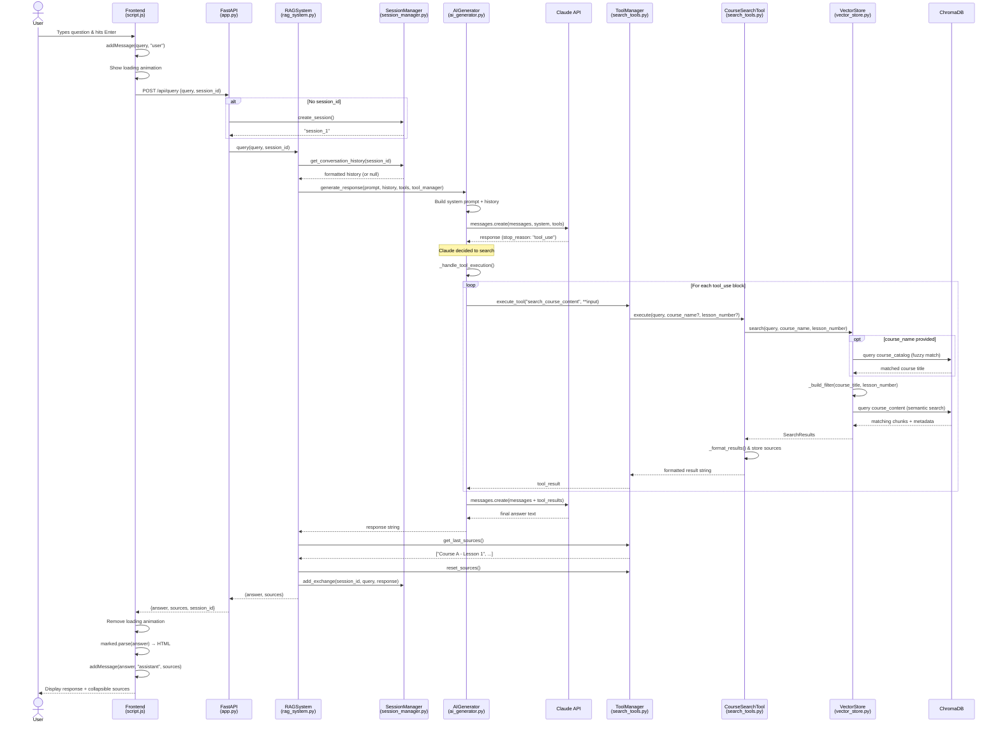

# RAG Chatbot - Sequence Diagram

```mermaid
sequenceDiagram
    actor User
    participant FE as Frontend<br/>(script.js)
    participant API as FastAPI<br/>(app.py)
    participant RAG as RAGSystem<br/>(rag_system.py)
    participant SM as SessionManager<br/>(session_manager.py)
    participant AI as AIGenerator<br/>(ai_generator.py)
    participant Claude as Claude API
    participant TM as ToolManager<br/>(search_tools.py)
    participant CST as CourseSearchTool<br/>(search_tools.py)
    participant VS as VectorStore<br/>(vector_store.py)
    participant Chroma as ChromaDB

    User->>FE: Types question & hits Enter
    FE->>FE: addMessage(query, "user")
    FE->>FE: Show loading animation

    FE->>API: POST /api/query {query, session_id}

    alt No session_id
        API->>SM: create_session()
        SM-->>API: "session_1"
    end

    API->>RAG: query(query, session_id)

    RAG->>SM: get_conversation_history(session_id)
    SM-->>RAG: formatted history (or null)

    RAG->>AI: generate_response(prompt, history, tools, tool_manager)

    AI->>AI: Build system prompt + history
    AI->>Claude: messages.create(messages, system, tools)
    Claude-->>AI: response (stop_reason: "tool_use")

    Note over AI: Claude decided to search

    AI->>AI: _handle_tool_execution()

    loop For each tool_use block
        AI->>TM: execute_tool("search_course_content", **input)
        TM->>CST: execute(query, course_name?, lesson_number?)
        CST->>VS: search(query, course_name, lesson_number)

        opt course_name provided
            VS->>Chroma: query course_catalog (fuzzy match)
            Chroma-->>VS: matched course title
        end

        VS->>VS: _build_filter(course_title, lesson_number)
        VS->>Chroma: query course_content (semantic search)
        Chroma-->>VS: matching chunks + metadata
        VS-->>CST: SearchResults

        CST->>CST: _format_results() & store sources
        CST-->>TM: formatted result string
        TM-->>AI: tool_result
    end

    AI->>Claude: messages.create(messages + tool_results)
    Claude-->>AI: final answer text
    AI-->>RAG: response string

    RAG->>TM: get_last_sources()
    TM-->>RAG: ["Course A - Lesson 1", ...]
    RAG->>TM: reset_sources()

    RAG->>SM: add_exchange(session_id, query, response)

    RAG-->>API: (answer, sources)
    API-->>FE: {answer, sources, session_id}

    FE->>FE: Remove loading animation
    FE->>FE: marked.parse(answer) → HTML
    FE->>FE: addMessage(answer, "assistant", sources)
    FE-->>User: Display response + collapsible sources
```
